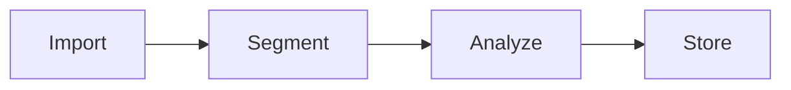

# Documentation Style Guide

This document defines standards for writing and maintaining documentation in the StoryGen project.

## Document Types

### Technical Documentation

Located in `docs/architecture/` and `docs/implementation/`:

- Architecture overviews and feature-specific designs
- Implementation plans and status tracking
- API references and integration guides

### Process Documentation

Located in `docs/documentation/`:

- Coding standards and style guides
- Contribution guidelines
- Checklists and workflows

### Proposal Documentation

Located in `docs/proposal/`:

- Feature proposals and specifications
- Design decisions and rationale
- Open questions and alternatives

## File Naming

- Use **kebab-case** for all documentation files: `coding-style.md`, `context-assembler.md`
- Use descriptive names that indicate content: `overview.md`, `plan.md`, `status.md`
- Prefix related documents consistently: `segmenter.md`, `segmenter-api.md`

## Document Structure

### Standard Template

```markdown
# Document Title

Brief description of what this document covers (1-2 sentences).

## Overview

High-level summary providing context and purpose.

## Main Sections

Content organized logically with clear headings.

### Subsections

Further breakdown as needed.

## Related Documents

- [Link to related doc](./related.md)
```

### Required Sections

Every technical document should include:

1. **Title** - Clear, descriptive H1 heading
2. **Overview/Purpose** - What and why
3. **Main Content** - The core information
4. **Related Documents** - Links to related docs (when applicable)

## Formatting Standards

### Headings

- Use sentence case: "Context assembly strategy" not "Context Assembly Strategy"
- Maintain hierarchy: H1 → H2 → H3 (don't skip levels)
- Keep headings concise but descriptive

### Code Blocks

Always specify language for syntax highlighting:

````markdown
```typescript
function example(): void {
  console.log('Hello');
}
```
````

Use inline code for:
- File names: `segmenter.ts`
- Function/variable names: `processSegment()`
- CLI commands: `npm run build`
- Configuration values: `"strict": true`

### Lists

Use bullet lists for unordered items:

```markdown
- First item
- Second item
- Third item
```

Use numbered lists for sequential steps or ranked items:

```markdown
1. Install dependencies
2. Configure environment
3. Run the application
```

### Tables

Use tables for structured data comparison:

```markdown
| Feature | Status | Priority |
|---------|--------|----------|
| Segmenter | Done | High |
| Bible | In Progress | High |
```

### Links

- Use relative paths for internal links: `[Overview](./overview.md)`
- Use descriptive link text: `[architecture overview](./overview.md)` not `[click here](./overview.md)`
- Verify links are valid before committing

## Writing Style

### Tone

- **Clear and direct** - Avoid jargon unless necessary
- **Technical but accessible** - Explain complex concepts
- **Concise** - Remove unnecessary words
- **Active voice** - "The segmenter processes files" not "Files are processed by the segmenter"

### Terminology

Maintain consistent terminology throughout:

| Term | Usage |
|------|-------|
| segment | A chunk of story content |
| bible | The story metadata store |
| context | Information assembled for LLM prompts |
| token | LLM processing unit |

### Examples

Include examples for complex concepts:

```markdown
## Token Budget Allocation

The context assembler distributes tokens across components:

| Component | Allocation |
|-----------|------------|
| System prompt | 2-3k tokens |
| Style guide | 1-2k tokens |

**Example**: For a 100k token budget, the style guide receives approximately 1,500 tokens.
```

## Diagrams

### ASCII Diagrams

Use ASCII art for simple flow diagrams:

```
┌─────────┐     ┌─────────┐     ┌─────────┐
│  Input  │────▶│ Process │────▶│ Output  │
└─────────┘     └─────────┘     └─────────┘
```

### Mermaid Diagrams

Use Mermaid for complex diagrams (supported by GitHub):

````markdown

````

## Checklists

### Format

Use GitHub-compatible checkbox syntax:

```markdown
- [ ] Incomplete item
- [x] Completed item
```

### Status Documents

Status documents should contain only checklists without additional commentary:

```markdown
# Implementation Status

## Phase 1: Core Infrastructure

- [x] Project setup
- [x] TypeScript configuration
- [ ] Basic CLI framework
- [ ] LLM interface

## Phase 2: Segmentation

- [ ] File parsing
- [ ] Segment boundaries
```

## Maintenance

### Updates

- Update documentation when code changes affect documented behavior
- Mark outdated sections clearly: `> **Note**: This section needs updating for v2.0`
- Review documentation during code review

### Versioning

- Keep documentation in sync with code versions
- Use git history to track documentation changes
- Tag significant documentation updates in commit messages

## Quality Checklist

Before committing documentation:

- [ ] Spelling and grammar checked
- [ ] All code examples tested
- [ ] Internal links verified
- [ ] Formatting renders correctly
- [ ] Consistent terminology used
- [ ] No sensitive information included
